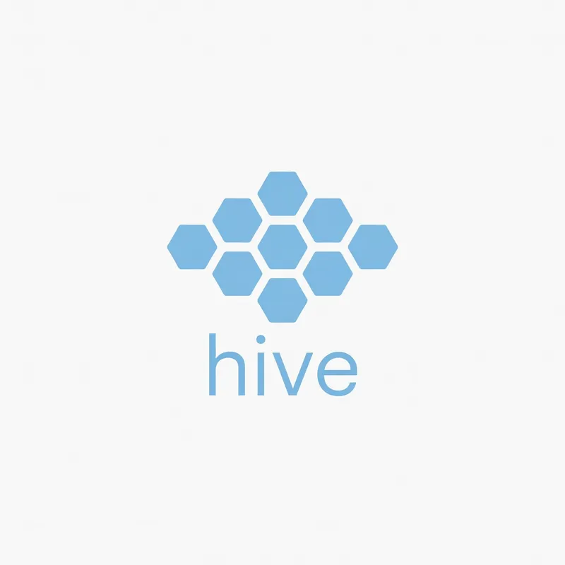

<p align="center">
  <a href="https://github.com/Yingjiacheng7651010/agent-hive">
    
  </a>
</p>

<h1 align="center">agent-hive 蜂群 —— 契约驱动的多智能体编排框架</h1>

<p align="center">
  <a href="https://github.com/Yingjiacheng7651010/agent-hive"></a>
  <a href="https://github.com/Yingjiacheng7651010/agent-hive/releases"></a>
  <a href="https://github.com/Yingjiacheng7651010/agent-hive/actions/workflows/pages.yml"></a>
  <a href="https://github.com/Yingjiacheng7651010/agent-hive/blob/main/LICENSE"></a>
  <br>
  
  
  
  
  
</p>

<blockquote>
<p><strong>一句话定位</strong>：一个「首脑」统一统筹多个角色专家——定架构、分包派发、验收集成；<strong>契约是运行时一等公民</strong>，架构安全验证与成本预算内嵌为审批关口的一等原语，全部以标准工件（JSON Schema / SARIF / OTel JSONL）对外输出。</p>
</blockquote>

<details>
<summary><strong>目录</strong>（点击展开）</summary>

| 章节 | 章节 |
|---|---|
| [官网 / 下载 / 发布](#官网--下载--发布) | [特性](#特性) |
| [四个空白维度的组合（差异化卖点）](#四个空白维度的组合差异化卖点) | [快速开始（框架）](#快速开始框架) |
| [30 秒演示](#30-秒演示) | [验证命令（全局验收）](#验证命令全局验收) |
| [Benchmark（真实数字，可复现）](#benchmark真实数字可复现) | [配置 API 密钥](#配置-api-密钥密钥只保留本地绝不上传仓库) |
| [检查范围 / 未覆盖范围声明](#检查范围--未覆盖范围声明) | [目录结构](#目录结构) |
| [安装 / 快速开始](#安装--快速开始) | [设计依据 / 安全 / License](#设计依据借鉴的开源项目) |

</details>

## 官网 / 下载 / 发布

- **官网**：<https://yingjiacheng7651010.github.io/agent-hive/>（GitHub Pages 静态站，零遥测；PWA 支持 iOS「添加到主屏幕」安装）
- **Releases**：<https://github.com/Yingjiacheng7651010/agent-hive/releases>（Windows setup.exe / macOS dmg / Linux AppImage / pip wheel + SHA256SUMS.txt）
- **发布流程与各平台安装说明**：[docs/releases.md](docs/releases.md)
- **Agent 智能体方向转型路线图**（LangChain / LangGraph 技术栈深化）：[docs/agent-transformation.md](docs/agent-transformation.md)
- **官网改版设计规范与 flash 提示词**（logo 品牌卡 + 逐阶段提示词）：[docs/website-rebrand-plan.md](docs/website-rebrand-plan.md)

本仓库同时包含两个宿主，共用同一套契约（`skill/contracts.md`，由 `agent_hive/contract_spec.py` 单一事实源渲染生成）：

| 宿主 | 位置 | 用法 |
|---|---|---|
| **DSH 技能**（会话内主模型当首脑） | `skill/` | 复制到 `~/.dsh/skills/agent-hive/`，对话中提到「首脑/统筹/智能体军团」即触发 |
| **LangGraph 程序**（独立运行） | `agent_hive/` | `uv run python -m agent_hive run --goal "..."` |

## 四个空白维度的组合（差异化卖点）

> [!NOTE]
> 调研实证（截至 2026-08）：主流 agent 框架（OpenAI Agents SDK / Claude Agent SDK / ADK / LangGraph）均无独立成本预算原语与模型熔断原语；本项目的差异化是下面四个维度的**组合**，且每条声明都可证伪（可审计的检查范围 + 规则版本 + 证据，见各模块 README 与 `benchmarks/`）。

| # | 维度 | 卖点 | 证据入口 |
|---|---|---|---|
| ① | **契约一等公民 + 防漂移** | 工作包契约是机器可读单一事实源：Pydantic `PackageSpec` → 公开 JSON Schema（`contracts/workpackage.schema.json`）→ `contract-lint` CLI 独立校验 → `generate_contracts.py --check` 漂移检查进 CI | `contracts/`、`scripts/contract_lint.py` |
| ② | **契约级 HITL 验收回流** | 验收不通过自动带反馈返工（≤3 轮后熔断，可归因责任包）；人工审批只在「架构方案 + 批次表」两个**契约级关口**，而非逐次工具审批 | `agent_hive/`、`docs/card-async-hitl.md` |
| ③ | **架构安全验证内嵌审批关口** | 审批①之前自动跑 `hive-security` 确定性规则引擎（幻觉引用/循环依赖/缺失控制/架构反模式，12 条威胁目录映射 CWE + OWASP LLM Top 10 2025），fail 自动回流重做；SARIF/退出码可进 CI | `hive_security/`、`benchmarks/security/` |
| ④ | **成本预算 + 模型熔断一等原语** | 独立包 `hive-cost`：`CostGate` 预算检查/降级链/阻断 + 重试/熔断/fallback 链，OTel 兼容 JSONL 导出（可被 Langfuse/LangSmith 消费）；主流 agent SDK 全部缺失此原语 | `hive_cost/`、`benchmarks/cost/` |

## 30 秒演示

**架构安全验证**（独立包，一条命令）：

```bash
pip install hive-security
hive-security scan --input arch.json --format sarif --output report.sarif
# 退出码：0 = pass/pass_with_warnings；2 = fail（可阻断 CI）；3 = 执行错误
# arch.json 形如 {"overview": "...", "modules": [{name, responsibility, interfaces,
#   owner_role, depends_on?}], "risks": ["..."]}
```

**成本预算**（独立包，调用前后打点）：

```python
from hive_cost.budget import CostBudget
from hive_cost.gate import CostGate

gate = CostGate(budget=CostBudget(max_tokens=100_000, warn_ratio=0.8))
decision = gate.check_before_call("deepseek-chat", "编码")   # proceed / downgrade / block
gate.record_after_call("deepseek-chat", "编码", 1200, 300)   # 成本按定价表估算
gate.to_otel_events()                                        # OTel 兼容事件，JSONL 落盘
```

## Benchmark（真实数字，可复现）

> [!NOTE]
> 全部数字由 `benchmarks/` 确定性运行产出（无 random，同输入两次运行逐字节一致），复现命令见 `benchmarks/README.md`。

| 基准 | 结果 | 复现 |
|---|---|---|
| **安全验证**（129 样例 = 14 手工 + 115 模板生成，10 个威胁家族） | 检出率 **1.0000** / 误报率 **0.0000** / verdict 准确率 **1.0000**（129/129 达标）；avg 延迟 0.08ms / p99 0.54ms（单机环境相关） | `uv run python benchmarks/security/run.py` |
| **成本预算**（100 任务 × 每任务 3-20 次模型调用，三档预算） | 完成率 100.0% → 64.0%（70% 预算）→ 52.2%（50% 预算）；任务成本均值 $0.0040 → $0.0026 → $0.0019；降级 0 → 95 → 85 次；block 0 → 37 → 47 次；告警 0 → 227 → 217 条 | `uv run python benchmarks/cost/run.py` |

## 检查范围 / 未覆盖范围声明

**检查范围**：`hive-security` 为确定性规则引擎，只消费结构化架构 JSON（不解析 markdown/源码），执行四项检查——幻觉引用（未定义引用名）、循环依赖（三色 DFS）、缺失安全控制（威胁关键词命中但控制词缺失，12 条威胁目录）、架构反模式（risks 空/无 owner/模块数越界/执行类接口无降级设计）；SARIF 输出携带 CWE / OWASP LLM Top 10 (2025) 映射；`hive-cost` 覆盖预算检查、降级链、熔断/重试/fallback 与 OTel 兼容导出。

> [!IMPORTANT]
> **未覆盖范围**：不解析源码、不扫描依赖/供应链、不做动态渗透测试；不调用 LLM 语义验证通道（`llm_enabled` 仅透传）；不做「绝对安全」结论——「pass」只表示在给定输入与规则版本下未命中规则；成本为估算值（内置静态价格表），不接入真实计费 API。完整声明见 `hive_security/README.md` 与 `hive_cost/README.md`。

## 安装 / 快速开始

```bash
# 独立组件（任意框架可消费）
pip install hive-security hive-cost

# 本仓库（完整框架 + 测试 + benchmark）
git clone <repo-url> && cd agent-hive
uv sync                        # 安装依赖（含 hive-security / hive-cost editable）
uv run python -m agent_hive run --goal "做一个命令行待办事项管理器（Python）"
```

框架运行细节与 API 密钥配置见下文「快速开始」「配置 API 密钥」。

## 特性

- **首脑协议**：盘点兵力 → 定架构 → 审批① → 分包（契约化工作包）→ 审批② → 按依赖层派发 → 验收评审 → 集成
- **契约先行**：每个工作包带接口契约、`expected_output`、`depends_on`、可逐项打勾的验收标准
- **评估-优化回路**：验收不通过自动回派（带具体差距），逐包计数、最多返工 3 次后熔断；`reassign_to` 支持当前 active wave 内归因，跨波归因记录警告且前序通过包保持冻结
- **守卫规则**：输入守卫（危险目标拦截）、输出守卫（交付物存在性与路径程序化校验，先于 LLM 评审）、熔断守卫
- **依赖感知 fan-out**：同层 `Send` 分支真实并发；下游必须等待依赖通过；返工只重派目标包；熔断向下游传播为阻塞
- **整体集成守卫**：通过包扁平合并到统一 `dist/`，同路径冲突拒绝覆盖，Python 静态编译、`manifest.json`、staging 原子替换
- **项目看板**：工件状态机全程可审计（待派发→进行中→待验收→通过/返工→熔断/阻塞）
- **权限分层 T0/T1/T2**：全开放（定位提示+窄探测）/ 只开放工作区（先出工程提示词包再回填分工）/ 零披露（顾问模式）
- **派发资格评审**：调用外部智能体必须「能力胜出 + 省时高效」双关通过（证据不足一律不派）
- **成本可观测**：每次运行落盘 `cost.json`（模型调用次数与 token 用量）
- **架构安全验证**：审批①之前自动做「规则引擎（幻觉引用/循环依赖/缺失安全控制/架构反模式）+ LLM 语义验证」双通道校验；fail 自动回流重做，安全报告随审批单展示；`--skip-arch-security`/`--allow-insecure-architecture` 显式开关且写入审计
- **断点续跑**：`--run-id` + `--thread-id` 恢复中断的运行

## 快速开始（框架）

```bash
# 1. 安装 uv（https://docs.astral.sh/uv/）后同步依赖
uv sync

# 2. 配置 API 密钥（见下一节「配置 API 密钥」）
cp .env.example .env   # 然后编辑 .env 填入你的密钥

# 3. 运行
uv run python -m agent_hive run --goal "做一个命令行待办事项管理器（Python）"
# 无头自动审批（测试用）：--yes
# 顾问模式（不派发，只出架构+工程提示词包）：--tier T2
# 断点续跑：--run-id 20260824_xxxxxx_abcd --thread-id hive-20260824_xxxxxx_abcd
# 架构安全验证（默认开启，LLM 语义验证失败自动降级为纯规则引擎）：
#   显式跳过：--skip-arch-security（写入审计，报告如实标注）
#   fail 放行：--allow-insecure-architecture（写入审计）
#   自定义策略：--security-policy-file policy.json（fail_on_severity 不允许低于 high）
# 显式开启一个全局检查（默认不会执行任意动态命令；argv 始终 shell=False）
# PowerShell 推荐先创建 checks.json，避免原生参数转义吞掉 JSON 引号：
# [{"name":"verify","argv":["python","scripts/verify.py"]}]
uv run python -m agent_hive run --goal "..." --yes \
  --allow-integration-checks --integration-check-file checks.json
# Bash 也可直接传 JSON：--integration-check '{"name":"tests","argv":["python","-m","pytest","-q"]}'
```

## 验证命令（全局验收）

```bash
uv run python scripts/verify.py          # pytest + compileall + contract drift + contract lint + golden 一键验收
uv run pytest -q                         # 当前：409 passed
uv run python -m compileall -q agent_hive tests
uv run python scripts/generate_contracts.py --check
uv run python scripts/security_benchmark.py   # 安全验证 benchmark（129 样例）
uv run python benchmarks/security/run.py      # 可复现 benchmark 报告（results.json + report.md）
uv run python benchmarks/cost/run.py          # 成本预算 benchmark（三档预算）
```

## 配置 API 密钥（密钥只保留本地，绝不上传仓库）

本项目沿用主流开源 AI 项目的做法（[openai-quickstart-python](https://github.com/LinggarM/openai-quickstart-python) 的 `.env.example` 拷贝模式、[gpt-engineer](https://github.com/AntonOsika/gpt-engineer/blob/main/.env.template) 的 `.env.template` 模式）：

1. **复制模板**：`cp .env.example .env`（Windows: `copy .env.example .env`）

> [!WARNING]
> **改哪一个文件**：只改 `.env`，不要改 `.env.example`。`.env` 已被 `.gitignore` 排除，任何情况下不会进入 git 历史。

3. **每个变量的作用与获取方式**：

| 变量 | 作用 | 获取方式 |
|---|---|---|
| `DEEPSEEK_API_KEY` | 首脑与专家的模型（deepseek-chat） | https://platform.deepseek.com → API Keys |
| `TAVILY_API_KEY` | 调研专家的联网搜索工具 | https://app.tavily.com → API Keys（有免费额度） |
| `DASHSCOPE_API_KEY` / `DASHSCOPE_BASE_URL` | （可选）阿里云百炼模型，按需替换模型供应商 | https://bailian.console.aliyun.com → API-KEY |
| `HIVE_ALLOW_SHELL` | 是否允许编码/测试专家真实执行命令（默认 `0` 禁用） | 本地安全开关，见 SECURITY.md |

4. **代码在哪里读密钥**：`agent_hive/main.py` 入口调用 `load_dotenv()` 从项目根目录 `.env` 读取；专家子进程环境**自动剔除一切密钥变量**（`agent_hive/specialists.py` 的 `_safe_env()`），防止经命令执行泄露。
5. **验证密钥是否生效**：运行后看产物目录 `agent_hive/runs/<run_id>/cost.json` 与 `final_report.md` 正常生成即可。

## 目录结构

```
├── skill/               # DSH 技能（SKILL.md 协议 / registry.md 注册表 / contracts.md 契约）
├── agent_hive/          # LangGraph 首脑程序（threat_model / arch_security / cost_control /
│                        #   model_resilience 为薄壳，事实源在 hive_security / hive_cost）
│   ├── graph.py         # 编排图（审批、依赖层 fan-out、评估-优化回路）
│   ├── scheduler.py     # 依赖图校验、ready 层、返工与阻塞传播（纯函数深模块）
│   ├── chief.py         # 首脑节点（架构/分包/评审/集成、看板、用量统计）
│   ├── integration.py   # 统一 dist、冲突检测、manifest、原子集成与可选全局检查
│   ├── specialists.py   # 专家节点（角色提示词 + 受限文件/命令工具，最小权限裁剪）
│   ├── contract_spec.py # 契约机器可读单一事实源
│   ├── state.py / main.py / paths.py / scope_auth.py / prompts.py ...
├── hive_security/       # 独立零依赖包：架构安全验证（威胁目录/规则引擎/CWE+OWASP 映射/CLI）
├── hive_cost/           # 独立零依赖包：成本预算 + 模型熔断（CostGate/OTel JSONL）
├── contracts/           # 公开 JSON Schema（workpackage.schema.json）+ 样例
├── benchmarks/          # 可复现 benchmark（security / cost，results.json + report.md）
├── assets/              # 品牌资产（logo.webp，README 与官网共用）
├── site/                # GitHub Pages 官网（静态站零遥测 + PWA，iOS 可添加到主屏幕）
├── docs/                # 设计/审计文档（docs/audits/ 为负责任安全审计报告）
├── tests/               # 回归测试（当前 409 项，含架构安全验证与 golden 语料）
├── scripts/             # 契约生成/漂移检查/contract-lint/全局验收/benchmark 运行器
├── .env.example         # 环境变量模板（密钥修改处）
└── SECURITY.md          # 安全模型与信任边界
```

## 设计依据（借鉴的开源项目）

- [MetaGPT](https://github.com/FoundationAgents/MetaGPT)（共享消息池/类型化工件）→ 项目看板 + 结构化回传 + 共享工作区
- [CrewAI](https://github.com/crewAIInc/crewAI)（Manager 评估返工、expected_output、任务依赖）→ 评估-优化回路 + 工作包结构化字段
- [LangGraph](https://github.com/langchain-ai/langgraph)（supervisor、Send 并行、interrupt 人机协同）→ 图编排与审批关口
- [OpenAI Agents SDK](https://github.com/openai/openai-agents-python)（guardrails、max_turns）→ 守卫规则与熔断
- [Anthropic 多智能体模式](https://claude.com/blog/common-workflow-patterns-for-ai-agents-and-when-to-use-them)（orchestrator-workers、evaluator-optimizer）→ 首脑-专家 + 评审回路
- Claude Code 子代理（交接文档、文件所有权、上下文经济）→ 受限工具与交接文档

## 安全

本项目让 LLM 持有文件与命令工具，**默认禁用命令执行**，完整安全模型见 [SECURITY.md](SECURITY.md)。仓库内不出现任何 token/密钥：API 密钥只存本地 `.env`（已 gitignore）；PyPI 发布使用 Trusted Publishing（OIDC），CI 工作流内无明文凭据。

## License

[MIT](LICENSE)（`hive_security/` 与 `hive_cost/` 各含同名 LICENSE，随 wheel 分发）
